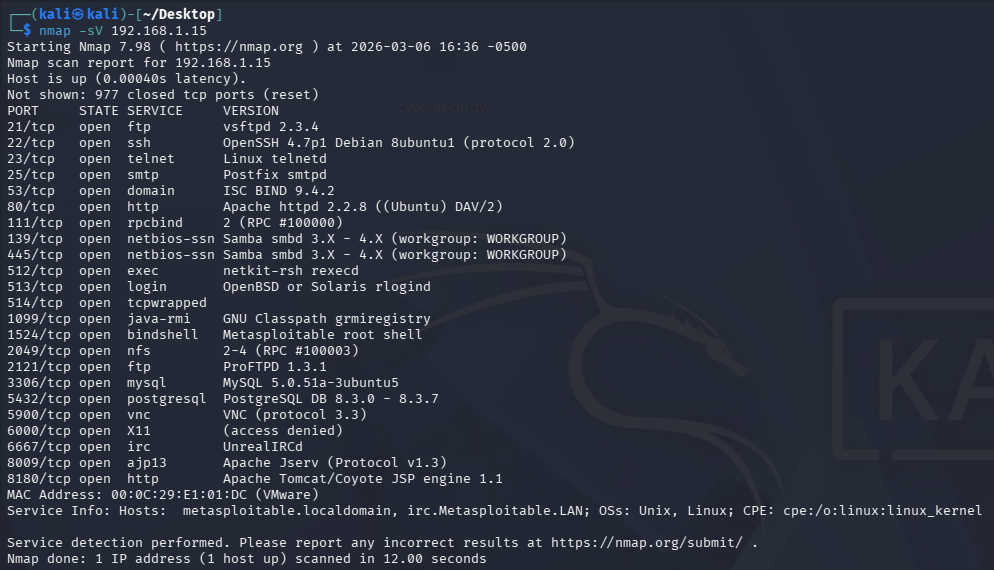
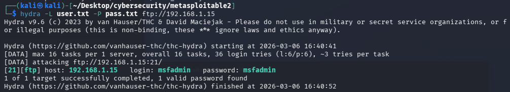
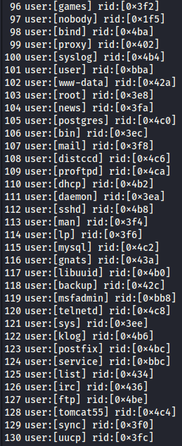
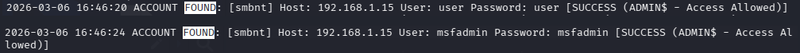
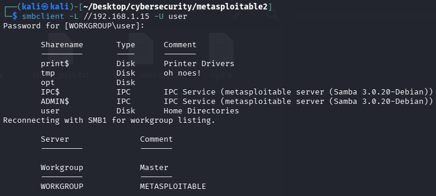
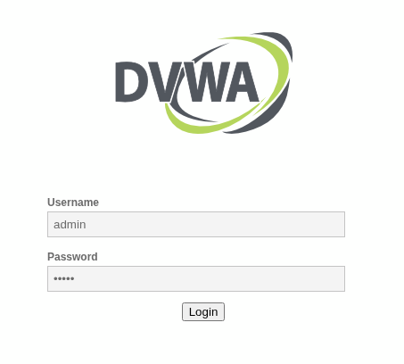
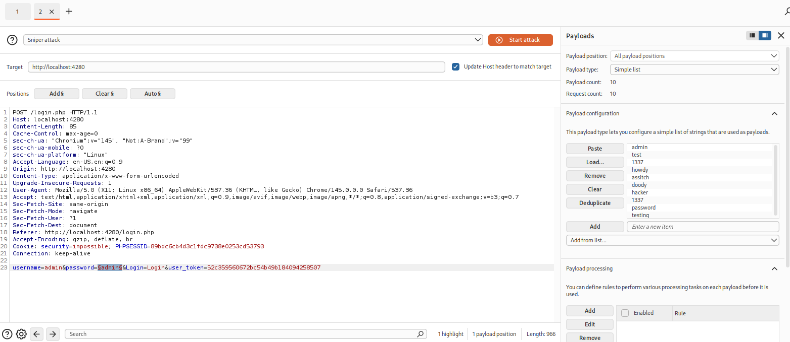
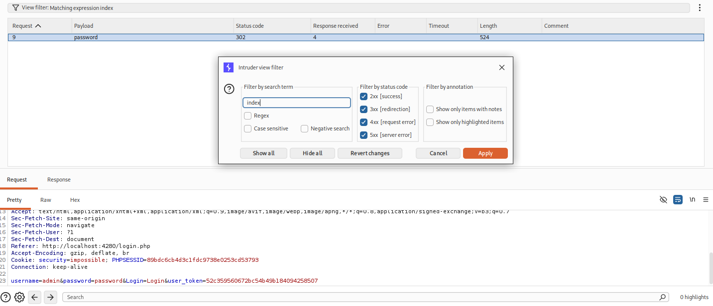

# Projeto kali, metasploitable2, DVWA exploit com Burpsuite

## Links para downloads:

[DVWA](https://github.com/digininja/DVWA)  
[VMWARE-Kali](https://cdimage.kali.org/kali-2025.4/kali-linux-2025.4-vmware-amd64.7z)  
[Metasploitable-2](https://sourceforge.net/projects/metasploitable/files/latest/download)  

## instalando Docker

```bash
sudo apt install docker.io -y
sudo apt install docker-compose -y
sudo docker compose up -d
```
## Visualizando e acessando o docker bash

```bash
sudo docker ps
sudo docker exec -it [CONTAINER ID] bash
```

### Verificando portas abertas em Metasploitable2

---

### Ataque FTP no Metasploitable2


### Verificando usuários SMB com enum4linux e salvando o resultado em e.txt
```bash
enum4linux -a 192.168.1.15 | tee e.txt
```
  
Posteriormente, crie um user.txt com esses usuários e utilize uma lista pass.txt para brute force!

### Acacando SMB com medusa
Utilizei user.txt e pass.txt com as mesmas credênciais, na perspectiva de pegar valores repetidos:  
```bash
medusa -h 192.168.1.15 -U user.txt -P pass.txt -M smbnt -t2 -T50
```
Filtre os resultados no terminal com Ctrl+Shift+F e pesquise "FOUND":  
  
Com isso, foi identificado dois logins. Acessando via SMB:  
  

---

## Atacando Servidor DVWA com burpsuite:  
Intercepter o login, realize algum aleatório para iniciar o ataque com Intruder:
  

No burpsuite, insira uma lista de password no Payload:
  

A parte mais interessante. É comum todo acesso inicar em uma página chamada index. Portanto, após realizado o ataque de Brute Force, procure pela palavra chave index, com isso você irá descobrir a senha que acessou a página inicial:  
SENHA: password  
  

O Brute force com medusa ou hydra não é eficiente nesse login, pois, a cada tentativa é gerado um novo user_token, o que invalida o teste. Desse modo, o burpsuite destacou-se nessa exploração de login.
